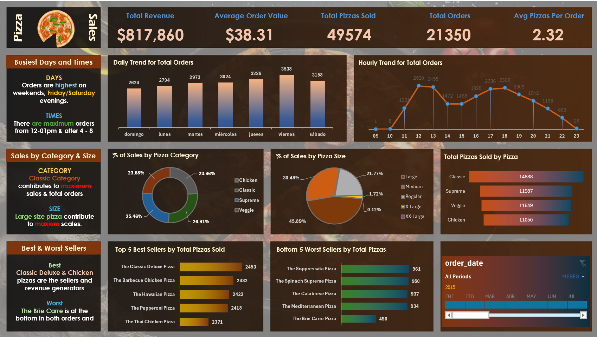

# Pizza Sales Analysis | SQL Server & Excel

This project simulates a real-world business scenario where SQL Server is used to validate key business metrics before building an interactive Excel dashboard.

The objective is to analyze one year of pizza sales data to answer business questions related to revenue, customer purchasing behavior, sales trends and product performance. The SQL analysis is then compared against the Excel dashboard to ensure that all reported KPIs are accurate and consistent.

---

## Dashboard



---

## Data Source

The project uses a public pizza sales dataset containing one year of transactional sales information.

The dataset includes:

- Order information
- Product details
- Date and time of purchase
- Pizza category and size
- Quantity sold
- Revenue generated

---

## Technologies

- Microsoft SQL Server Express
- SQL Server Management Studio (SSMS)
- Microsoft Excel
- Pivot Tables
- Pivot Charts
- Interactive Dashboard

---

## Business Questions

The project answers the following business questions:

- What is the total revenue generated?
- What is the average order value?
- How many pizzas were sold?
- How many orders were placed?
- What is the average number of pizzas per order?
- Which days generate the highest number of orders?
- Which hours have the highest demand?
- Which pizza categories contribute the most revenue?
- Which pizza sizes generate the most sales?
- What are the best-selling pizzas?
- What are the worst-selling pizzas?

---

## SQL Concepts Used

During the analysis, the following SQL concepts were applied:

- SELECT
- WHERE
- GROUP BY
- ORDER BY
- COUNT(DISTINCT)
- SUM
- CAST
- DATENAME
- DATEPART
- Aggregate Functions

---

## Project Structure

```
pizza-sales-sql-excel-dashboard
│
├── dashboard
│   ├── Pizza Sales Dashboard.xlsx
│   └── dashboard_preview.png
│
├── data
│   ├── pizza_sales.csv
│   └── pizza_sales.xlsx
│
├── sql
│   └── pizza_sales_queries.sql
│
└── README.md
```

---

## Results

The SQL queries were used to validate every KPI displayed in the Excel dashboard before visualization.

The final dashboard allows users to:

- Filter results dynamically by order date.
- Monitor overall sales performance.
- Identify peak business hours.
- Compare pizza categories and sizes.
- Detect top and bottom performing products.

---

## Key Insights

The analysis shows that sales are concentrated around lunch and dinner hours, with specific pizza categories consistently generating the highest revenue.

The dashboard also highlights the contribution of different pizza sizes and identifies both the highest-performing and lowest-performing products, providing useful insights for inventory planning and business decision-making.

---